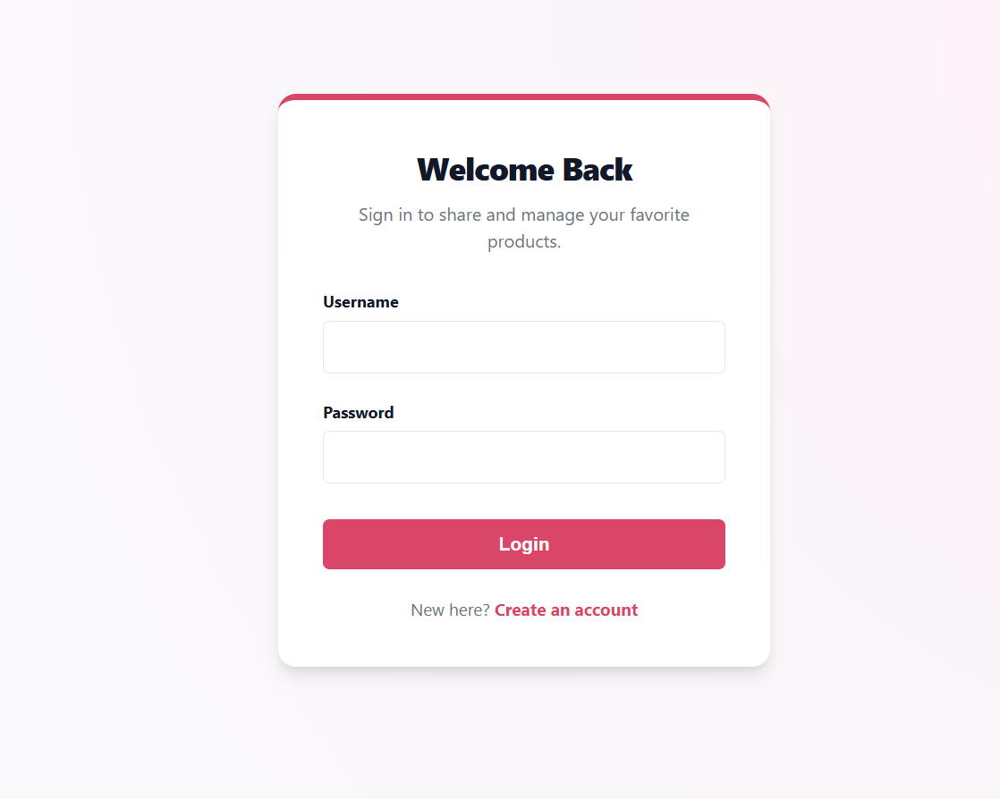
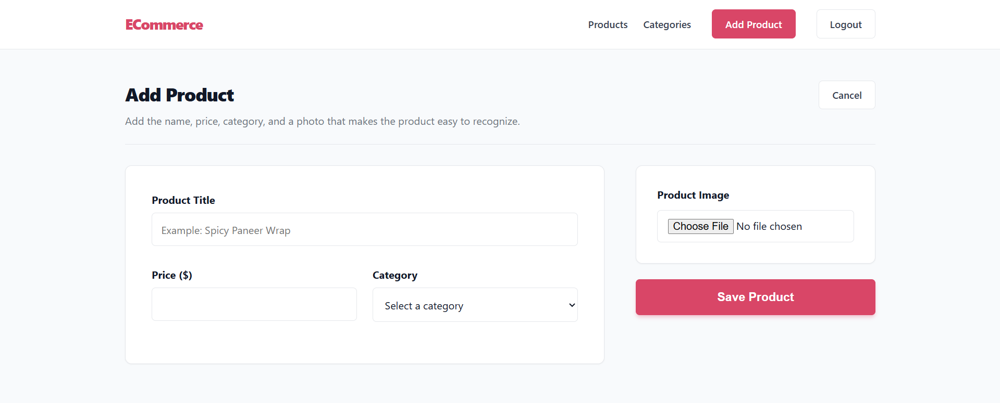
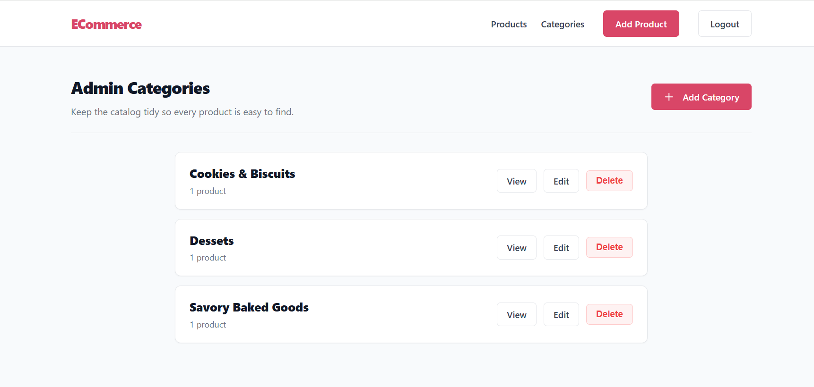
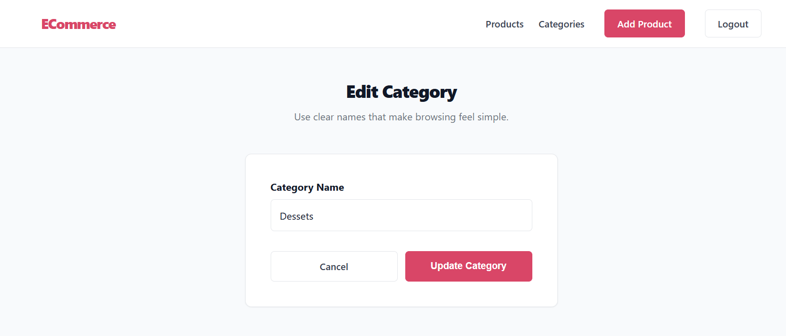
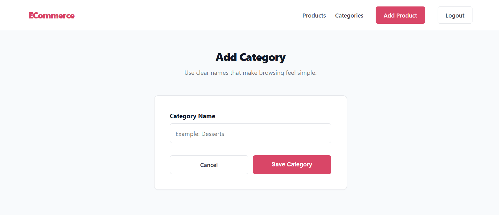
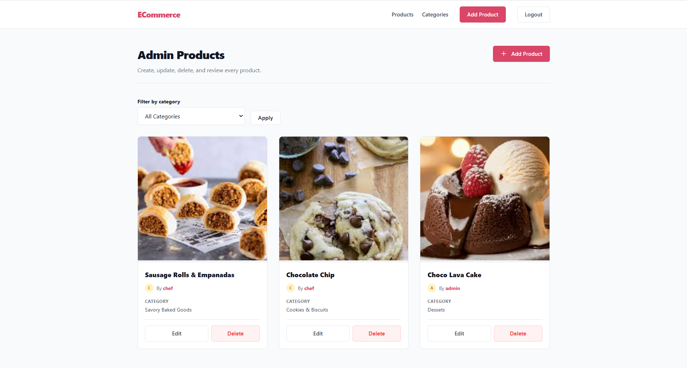
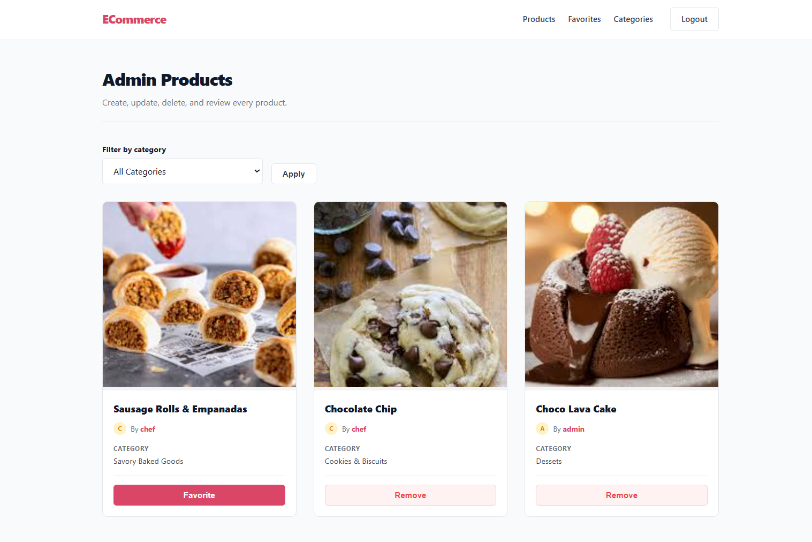
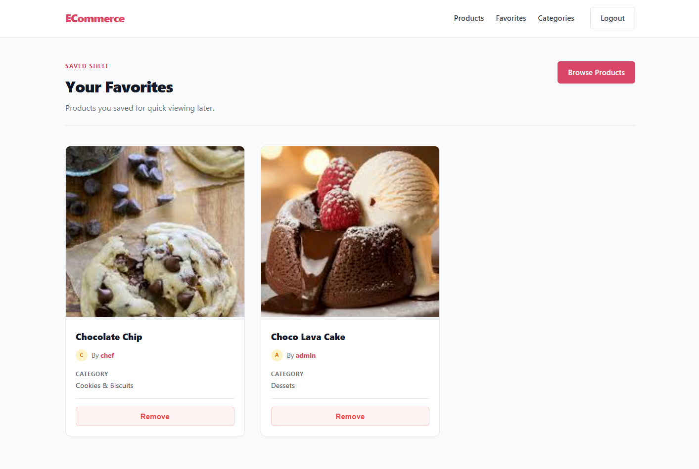

# ecommerce - Product & Category Management System

A full-stack Product Management System built with Node.js, Express.js, MongoDB, EJS, and CSS.

ecommerce provides a clean and modern interface for managing products, categories, favorites, authentication, and image uploads.

---

## Screen Shots

### Login Page


### Add Product Page


### All Categories Page


### Edit Page


### Add Page


### Dashboard Page


### User Dashboard Page


### Favourites Page


## Features

### Authentication

* User Registration
* User Login
* Password Hashing with bcryptjs
* JWT Authentication
* Cookie-Based Authentication
* Protected Routes

### Product Management

* Add Product
* Edit Product
* Delete Product
* View Products
* Upload Product Images
* Filter Products by Category

### Category Management

* Create Categories
* Edit Categories
* Delete Categories
* Display Product Count per Category
* Browse Products by Category

### Favorites

* Add Products to Favorites
* Remove Products from Favorites
* Dedicated Favorites Page

### UI & Experience

* Responsive Layout
* EJS Templating Engine
* Custom CSS Styling
* Clean Card-Based Design
* User-Friendly Navigation

---

## Tech Stack

### Frontend

* EJS
* HTML5
* CSS3

### Backend

* Node.js
* Express.js

### Database

* MongoDB
* Mongoose

### Authentication

* JWT
* bcryptjs
* cookie-parser

### File Uploads

* Multer

---

## Dependencies

```json
{
  "bcryptjs": "",
  "cookie-parser": "",
  "ejs": "",
  "express": "",
  "jsonwebtoken": "",
  "mongoose": "",
  "multer": "",
  "nodemon": ""
}
```

---

## Project Structure

```bash
ecommerce/
│
├── controllers/
│   ├── authController.js
│   ├── productController.js
│   ├── categoryController.js
│   └── favoriteController.js
│
├── models/
│   ├── User.js
│   ├── Product.js
│   ├── Category.js
│   └── Favorite.js
│
├── routes/
│   ├── authRoutes.js
│   ├── productRoutes.js
│   ├── categoryRoutes.js
│   └── favoriteRoutes.js
│
├── middleware/
│   ├── auth.js
│   └── upload.js
│
├── public/
│   ├── css/
│   ├── images/
│   └── uploads/
│
├── views/
│   ├── partials/
│   ├── auth/
│   ├── products/
│   ├── categories/
│   └── favorites/
│
├── app.js
├── package.json
└── README.md
```

---

## Installation

### Clone Repository

```bash
git clone https://github.com/mastersahil/ecommerce.git

cd ecommerce
```

### Install Dependencies

```bash
npm install
```

### Start MongoDB

```bash
mongod
```

### Run Project

```bash
npm run dev
```
---

## Scripts

```json
{
  "dev": "nodemon app.js"
}
```

---

## Routes

### Authentication

| Method | Route     | Description    |
| ------ | --------- | -------------- |
| GET    | /register | Register Page  |
| POST   | /register | Create Account |
| GET    | /login    | Login Page     |
| POST   | /login    | Login User     |
| GET    | /logout   | Logout User    |

---

### Products

| Method | Route               | Description       |
| ------ | ------------------- | ----------------- |
| GET    | /products           | View Products     |
| GET    | /product/add        | Add Product Form  |
| POST   | /product/add        | Save Product      |
| GET    | /product/edit/:id   | Edit Product Form |
| POST   | /product/edit/:id   | Update Product    |
| GET    | /product/delete/:id | Delete Product    |

---

### Categories

| Method | Route                | Description        |
| ------ | -------------------- | ------------------ |
| GET    | /categories          | View Categories    |
| GET    | /category/add        | Add Category Form  |
| POST   | /category/add        | Save Category      |
| GET    | /category/edit/:id   | Edit Category Form |
| POST   | /category/edit/:id   | Update Category    |
| GET    | /category/delete/:id | Delete Category    |

---

### Favorites

| Method | Route                | Description     |
| ------ | -------------------- | --------------- |
| GET    | /favorites           | View Favorites  |
| POST   | /favorite/add/:id    | Add Favorite    |
| POST   | /favorite/remove/:id | Remove Favorite |

---

## Security Features

* Password Hashing
* JWT Authentication
* Cookie-Based Authorization
* Route Protection Middleware
* Input Validation
* Secure Image Upload Handling

---

## Future Improvements

* Search Functionality
* Pagination
* Product Details Page
* User Roles & Permissions
* Cloudinary Integration
* Product Ratings
* Product Reviews
* Analytics Dashboard
* Dark Mode

---

## Author

**Sahil**

Built with:

* Node.js
* Express.js
* MongoDB
* Mongoose
* EJS
* CSS

---