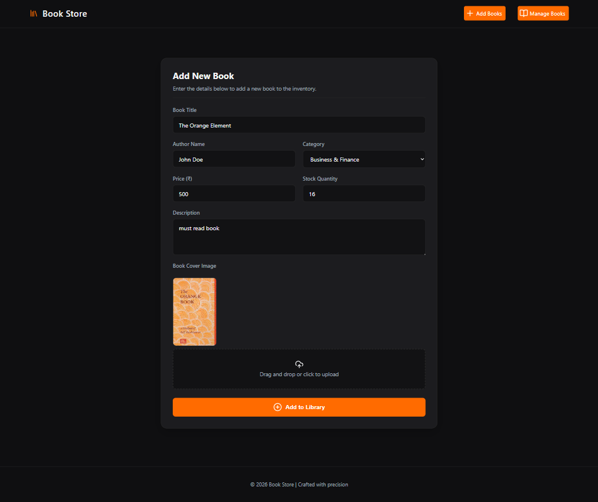
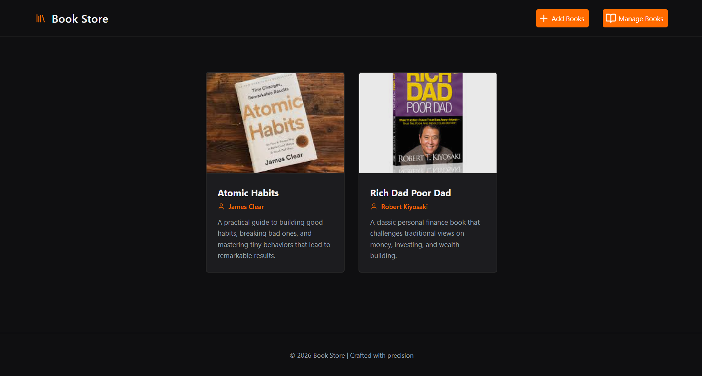
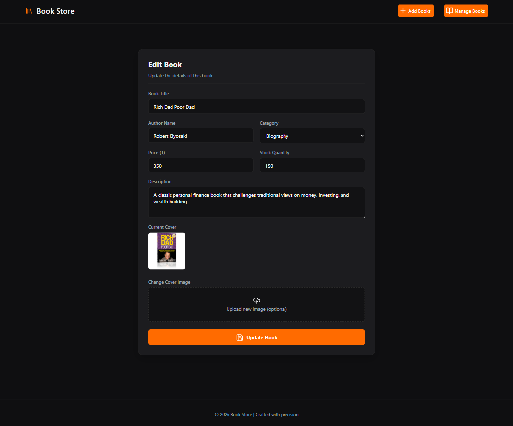
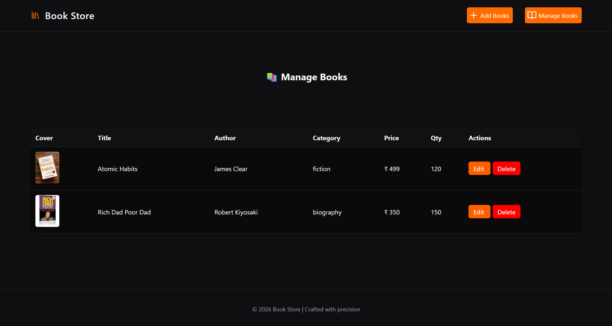

# 📚 Book Store App (EJS + Node.js + MongoDB)

A full-stack **Book Management System** built using **Node.js, Express, MongoDB, and EJS**.
This app allows users to **add, view, edit, and delete books** with image upload support.

---

## 🚀 Features

* 📖 View all books in a clean card UI
* ➕ Add new books with cover image upload
* ✏️ Edit book details (with image replacement)
* ❌ Delete books (removes image from storage too)
* 📂 Manage books in table format
* 🔍 View detailed single book page
* 🖼️ Image preview before upload
* ⚡ Fast server-side rendering with EJS

---

## 🛠️ Tech Stack

* **Frontend:** EJS, HTML, CSS, JavaScript
* **Backend:** Node.js, Express.js
* **Database:** MongoDB (Mongoose)
* **File Upload:** Multer
* **Templating:** EJS
* **Other:** dotenv, fs, path

---

## 📁 Project Structure

```
├── config/           # Database connection
├── controller/       # Business logic
├── model/            # Mongoose schema
├── routes/           # API routes
├── views/            # EJS templates
├── public/assets/    # CSS, JS, Images
├── uploads/          # Uploaded book covers
├── index.js          # Entry point
├── .env              # Environment variables
└── package.json
```

## 📌 API Routes

| Method | Route          | Description     |
| ------ | -------------- | --------------- |
| GET    | /api/books     | Get all books   |
| GET    | /api/books/:id | Get single book |
| POST   | /api/books     | Create new book |
| PUT    | /api/books/:id | Update book     |
| DELETE | /api/books/:id | Delete book     |

---

## 🧠 Key Learnings (Why this project matters)

This isn’t just CRUD. You’ve implemented:

* File upload handling with **Multer**
* File system cleanup using **fs**
* Server-side rendering with **EJS**
* RESTful API design
* MongoDB + Mongoose schema design
* Full MVC architecture

That’s real backend + full-stack work.

---

## 📸 Screenshots

*Add your screenshots here*









---

## ⚠️ Important Notes

* Uploaded images are stored in `/uploads`
* When updating:

  * Old image is deleted automatically
* When deleting:

  * Associated image is also removed from storage

---

## 💡 Future Improvements

If you want to level this up (and you should):

* 🔐 Add authentication (JWT / sessions)
* ☁️ Store images on Cloudinary / AWS S3
* 🔎 Add search & filter functionality
* 📊 Add pagination
* 🎨 Improve UI animations
* 🛒 Convert into full e-commerce system

---

## 👨‍💻 Author

**Sahil (Master Sahil)**
Full Stack Developer (MERN)

---

## ⭐ If you like this project

Give it a star ⭐ and improve it further — don’t just stop at CRUD.
