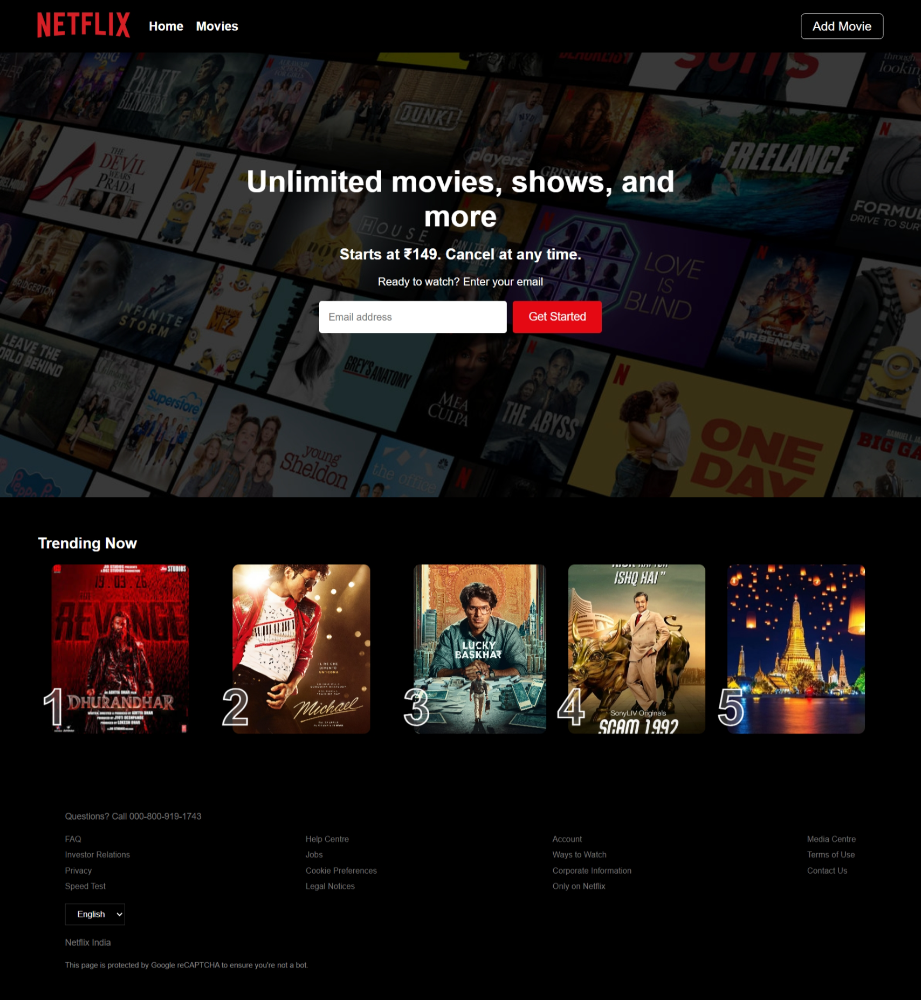
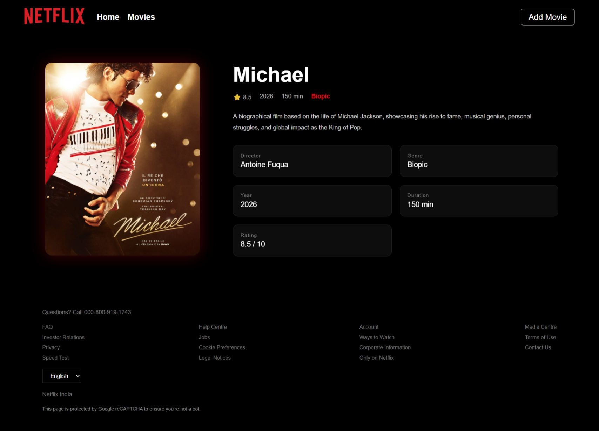
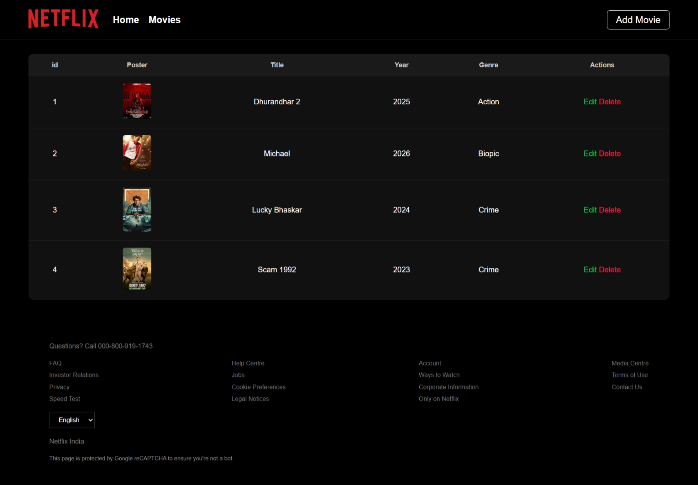
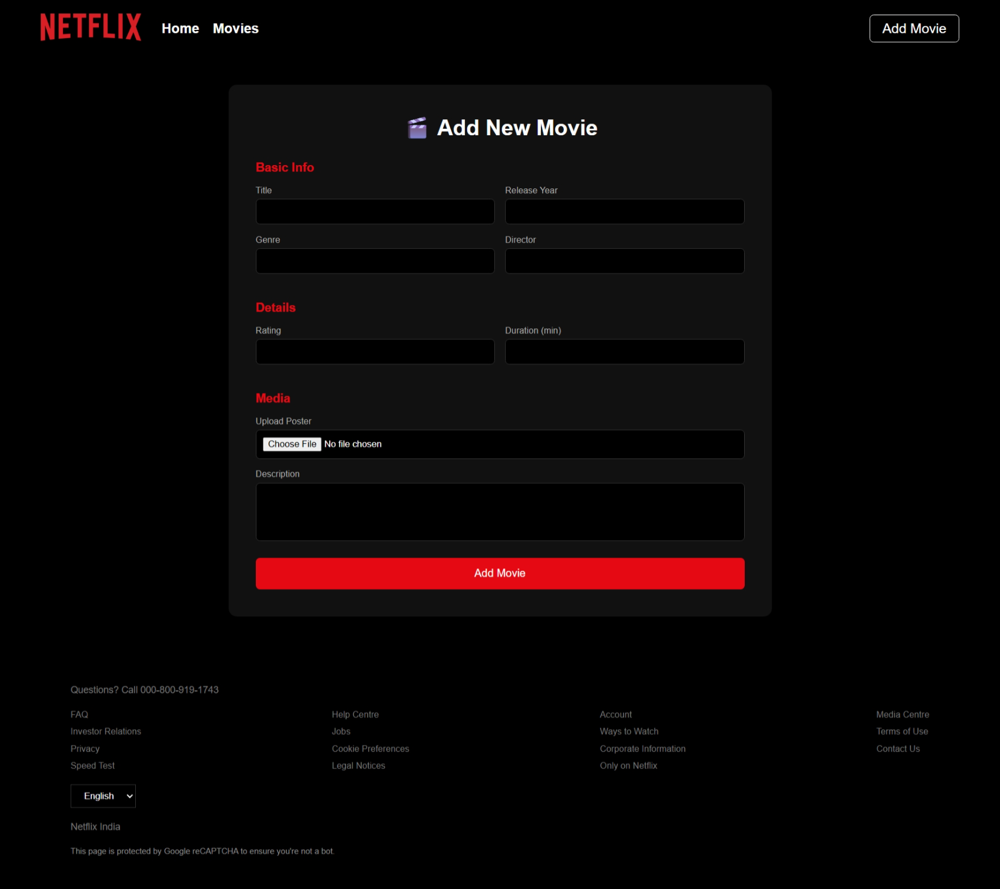
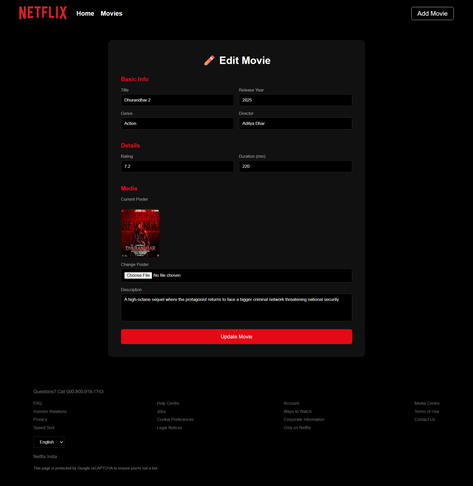

# 🎬 Netflix Clone – Movie Management System

A full-stack **Netflix-inspired Movie Management Web App** built using **Node.js, Express, MongoDB, and EJS**, where users can **add, view, edit, and delete movies** with poster uploads.

---

## 🚀 Features

* 🎥 Add new movies with complete details
* 📝 Edit existing movie data
* 🗑️ Delete movies
* 🖼️ Upload and display movie posters
* 📄 View detailed movie page
* 📊 Movies listing in table format
* 🎨 Netflix-style modern UI
* ⚡ Server-side rendering using EJS

---

## 🛠️ Tech Stack

### 💻 Backend

* Node.js
* Express.js
* MongoDB (Mongoose)

### 🎨 Frontend

* EJS (Templating Engine)
* CSS (Custom Netflix UI)

### 📦 Tools

* Multer (File Uploads)
* Dotenv (Environment Variables)
* Nodemon (Development)

---

## 📁 Project Structure

```
netflix-clone/
│
├── config/
│   └── db.js
│
├── controllers/
│   └── movieController.js
│
├── model/
│   └── movie.js
│
├── routes/
│   └── movieRoutes.js
│
├── views/
│   ├── add-movie.ejs
│   ├── edit-movie.ejs
│   ├── footer.ejs
│   ├── header.ejs
│   ├── index.ejs
│   ├── movies.ejs
│   └── view.ejs
│
├── public/assets/
│   ├── css/
│   ├── image/
│   └── screenshots/
│
├── upload/
│
├── index.js
├── package.json
└── .env
```

---

## Screenshots of Program

### Home Page

### View Page

### Movies Page

### Add Movies Page

### Edit Movies Page


---

## ⚙️ Installation & Setup

### 1️⃣ Clone the repository

```bash
git clone https://github.com/masterSahil/netflix_clone.git
cd netflix_clone
```

### 2️⃣ Install dependencies

```bash
npm install
```

### 3️⃣ Setup environment variables

Create a `.env` file:

```
PORT=8000
MONGO_URI=your_mongodb_connection_string
```

### 4️⃣ Run the project

```bash
npm run dev
```

👉 Server will run at: **[http://localhost:8000](http://localhost:8000)**

---

## 📌 Routes Overview

| Route                    | Method | Description       |
| ------------------------ | ------ | ----------------- |
| `/`                      | GET    | Home page         |
| `/movies`                | GET    | Movies list       |
| `/add`                   | GET    | Add movie page    |
| `/view/:id`              | GET    | View single movie |
| `/edit/:id`              | GET    | Edit movie page   |
| `/api/movies`            | POST   | Create movie      |
| `/api/movies/update/:id` | POST   | Update movie      |
| `/api/movies/delete/:id` | GET    | Delete movie      |

---

## 📦 Movie Schema Example

```json
{
  "title": "Inception",
  "year": 2010,
  "genre": "Sci-Fi",
  "director": "Christopher Nolan",
  "rating": 8.8,
  "duration": 148,
  "description": "A thief who steals corporate secrets through dream-sharing technology.",
  "poster": "upload/123456image.jpg"
}
```

---

## ⚡ Key Learnings

* File uploads using **Multer**
* MVC structure in Express
* MongoDB CRUD operations
* Dynamic UI with EJS
* Building real-world project architecture

---

## 👨‍💻 Author

**Sahil Master**
Full Stack Developer 🚀
