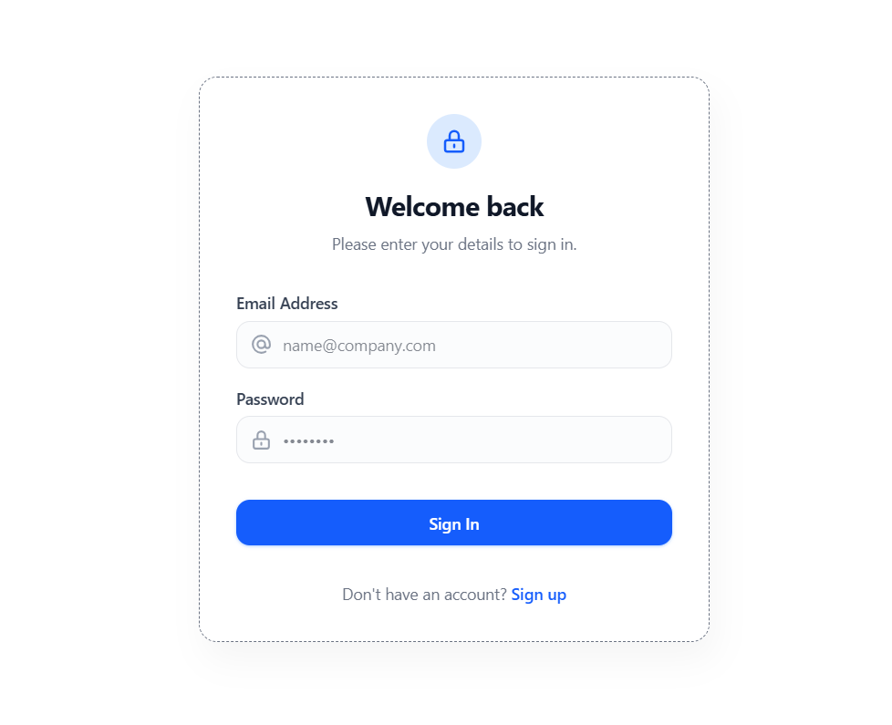
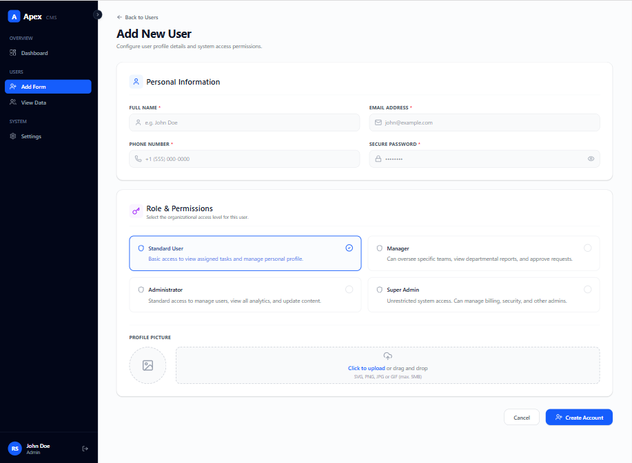

# 🚀 Admin Panel Dashboard (MERN Stack)

A fully functional Admin Panel built using the MERN stack with authentication, role management, and image upload functionality.


## 📌 Project Overview

This project is a modern Admin Dashboard where registered admins can:

* 🔐 Authenticate securely (Login/Logout)
* 👨‍💼 Manage other admins (Create, Read, Update, Delete)
* 🖼️ Upload images using Multer
* 🍪 Maintain sessions using cookies
* 🎨 Use a professional UI template (Apex Admin Panel)

---

## Program Screenshots

### Login Page


### Dashboard Page


### Add Data Page


### Manage Admins Page


---

## 🛠️ Tech Stack

### Frontend

* React.js
* React Router
* Tailwind CSS / Custom CSS
* Apex Admin Template

### Backend

* Node.js
* Express.js

### Database

* MongoDB (Mongoose)

### Other Tools & Libraries

* Multer (File Upload)
* Cookie-Parser (Session handling)
* bcrypt (Password hashing)
* Cookies (Authentication)

---

## 🔑 Features

* ✅ Admin Authentication System
* ✅ Secure Password Hashing
* ✅ Role-Based Admin Management
* ✅ CRUD Operations for Admins
* ✅ Image Upload (Single File)
* ✅ Responsive UI Dashboard
* ✅ Cookie-Based Session Handling

---

## 📂 Folder Structure

```
project-root/
│
├── client/             # React Frontend
│   ├── src/
│   ├── components/
│   └── pages/
│
├── server/             # Node + Express Backend
│   ├── controllers/
│   ├── models/
│   ├── routes/
│   ├── middleware/
│   └── uploads/
│
├── package.json
└── README.md
```

---

## ⚙️ Installation & Setup

### 1️⃣ Clone the Repository

```bash
git clone https://github.com/masterSahil/Node-Projects
cd admin-panel
```

---

### 2️⃣ Install Dependencies

#### Backend

```bash
cd backend
npm install
```

#### Frontend

```bash
cd frontend
npm install
```

---

### 3️⃣ Environment Variables

Create a `.env` file inside the **server** folder:

```env
PORT=5000
MONGO_URI=your_mongodb_connection_string
JWT_SECRET=your_secret_key
```

---

### 4️⃣ Run the Project

#### Start Backend

```bash
cd backend
npm run dev
```

#### Start Frontend

```bash
cd frontend
npm run dev
```

---

## 🔐 Authentication Flow

1. Admin registers/login
2. Password is hashed using bcrypt
3. Cookie is stored in browser
4. Protected routes verify authentication
5. Only logged-in admins can access dashboard

---

## 📸 Image Upload

* Implemented using **Multer**
* Stores images in `/uploads` folder
* Supports single image upload per admin

---

## 🧠 Learnings from this Project

* Full-stack integration (React + Node + MongoDB)
* Authentication & Authorization
* File handling with Multer
* REST API design
* MVC architecture

---