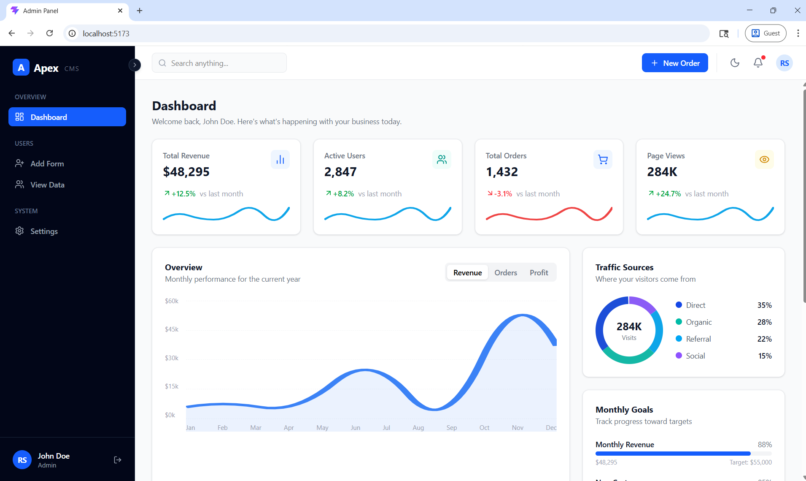
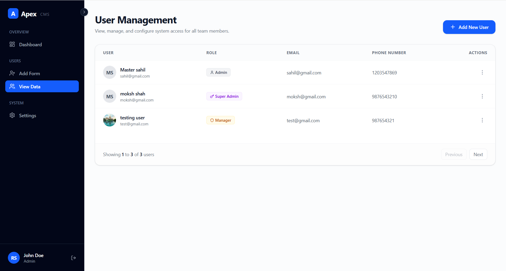
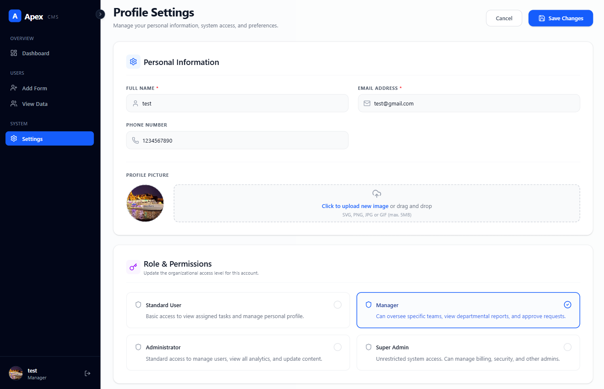

# 🚀 Admin Panel Dashboard (MERN Stack)

A fully functional Admin Panel built using the MERN stack with authentication, role management, image upload functionality, and Passport.js-based session handling.

---

## 📌 Project Overview

This project is a modern Admin Dashboard where registered admins can:

* 🔐 Authenticate securely using Passport.js (Login/Logout)
* 👨‍💼 Manage other admins (Create, Read, Update, Delete)
* 🖼️ Upload images using Multer
* 🍪 Maintain sessions using cookies
* 👤 View logged-in admin profile details
* 🎨 Use a professional UI template (Apex Admin Panel)

---

## Program Screenshots

### Login Page


### Dashboard Page


### Add Data Page


### Manage Admins Page


### Profile Settings Page


---

## 🛠️ Tech Stack

### Frontend

* React.js
* React Router
* Tailwind CSS / Custom CSS
* Apex Admin Template

### Backend

* Node.js
* Express.js
* Passport.js (Authentication Middleware)

### Database

* MongoDB (Mongoose)

### Other Tools & Libraries

* Multer (File Upload)
* Cookie-Parser (Session handling)
* bcrypt (Password hashing)
* express-session (Session management)

---

## 🔑 Features

* ✅ Admin Authentication using Passport.js
* ✅ Secure Password Hashing (bcrypt)
* ✅ Session-based Authentication (Cookies)
* ✅ Role-Based Admin Management
* ✅ CRUD Operations for Admins
* ✅ Image Upload (Single File)
* ✅ Logged-in User Profile Display
* ✅ Responsive UI Dashboard

---

## 📂 Folder Structure

```
project-root/
│
├── frontend/           # React Frontend
│   ├── src/
│   ├── components/
│   └── pages/
│
├── backend/            # Node + Express Backend
│   ├── controllers/
│   ├── models/
│   ├── routes/
│   ├── middleware/
│   └── uploads/
│
├── package.json
└── README.md
```

---

## ⚙️ Installation & Setup

### 1️⃣ Clone the Repository

```bash
git clone https://github.com/masterSahil/NodeJS-Project
cd admin-panel
```

---

### 2️⃣ Install Dependencies

#### Backend

```bash
cd backend
npm install
```

#### Frontend

```bash
cd frontend
npm install
```

---

### 3️⃣ Environment Variables

Create a `.env` file inside the **backend** folder:

```env
PORT=9000
MONGO_URI=your_mongodb_connection_string
SESSION_SECRET=your_session_secret
```

---

### 4️⃣ Run the Project

#### Start Backend

```bash
cd backend
npm run dev
```

#### Start Frontend

```bash
cd frontend
npm run dev
```

---

## 🔐 Authentication Flow (Passport.js)

1. Admin registers or logs in using credentials
2. Password is hashed using bcrypt before storing
3. Passport.js authenticates user using Local Strategy
4. Session is created and stored using cookies
5. Logged-in user data is accessible via `req.user`
6. Protected routes are secured using Passport middleware
7. User remains logged in until logout or session expires

---

## 👤 Logged-in User Profile

* Displays currently authenticated admin details
* Uses Passport session (`req.user`) to fetch user info
* Accessible across protected routes
* Enhances personalized dashboard experience

### Example Data:

* Username
* Profile Image
* Role (Admin)

---

## 📸 Image Upload

* Implemented using Multer
* Stores images in `/uploads` folder
* Supports single image upload per admin

---

## 🧠 Learnings from this Project

* Full-stack integration (React + Node + MongoDB)
* Authentication & Authorization using Passport.js
* Session management using cookies
* File handling with Multer
* REST API design
* MVC architecture

---