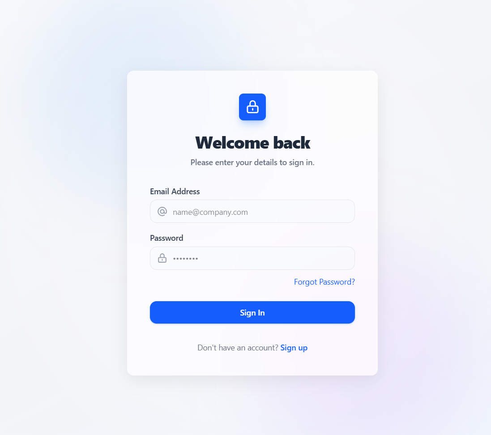
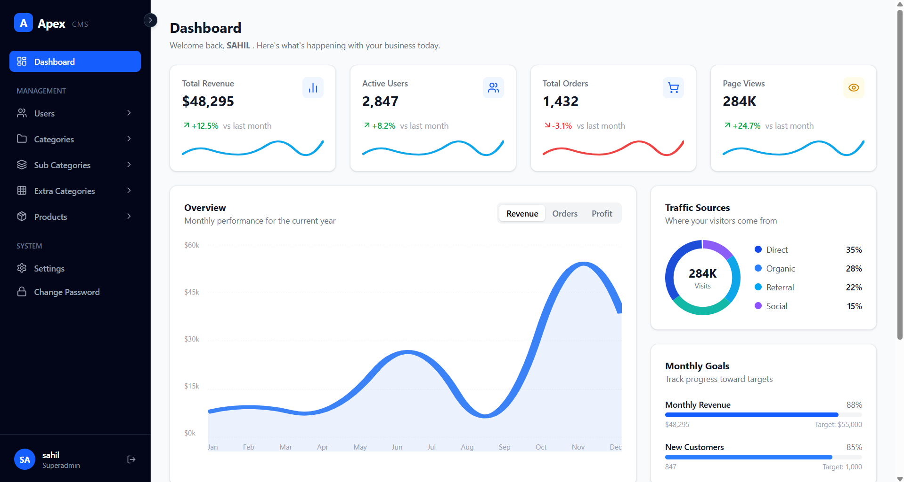
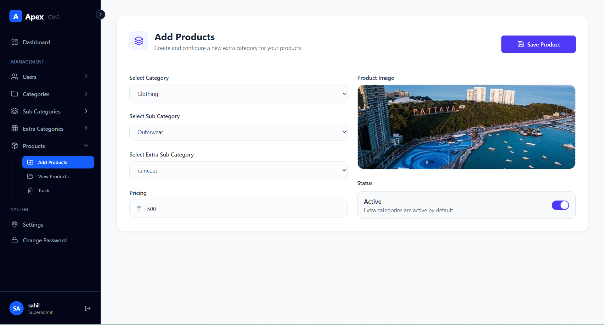
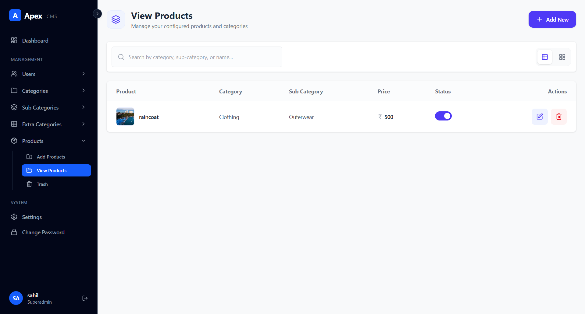
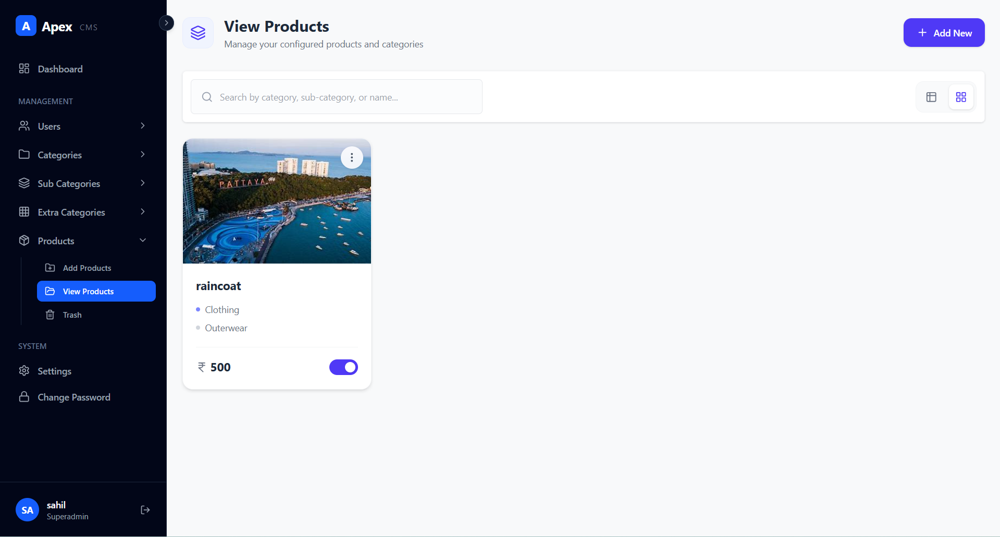
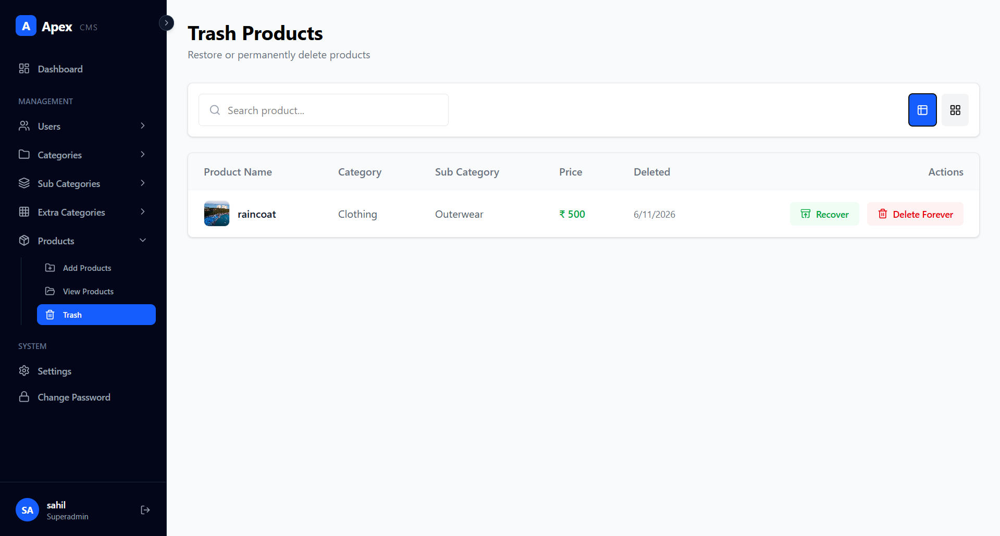
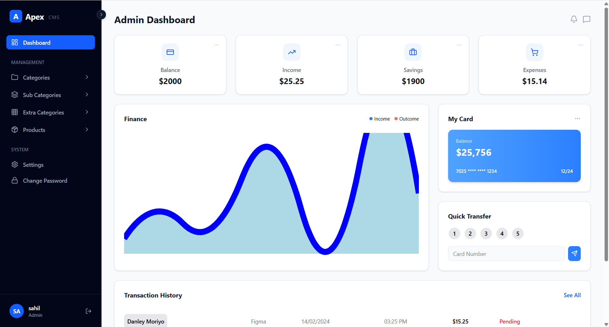
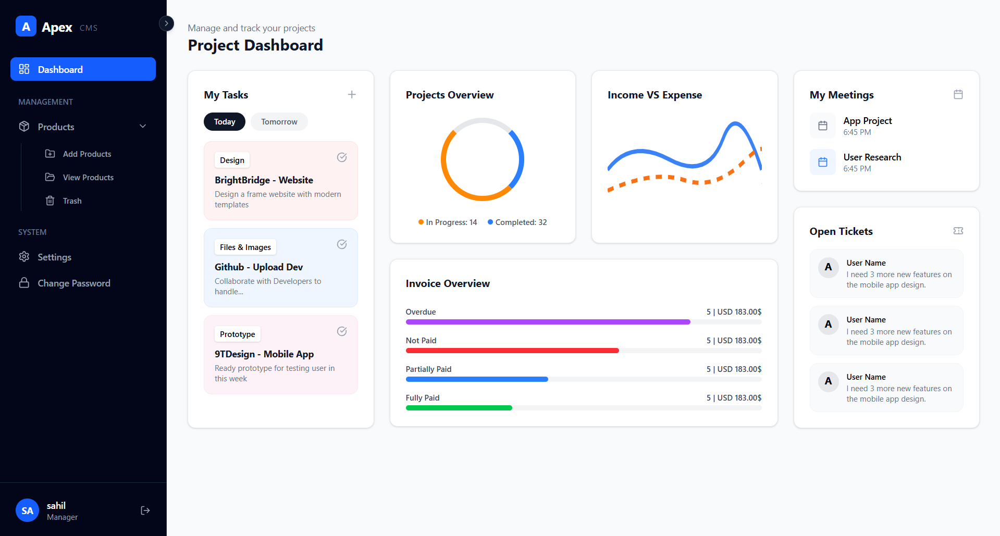
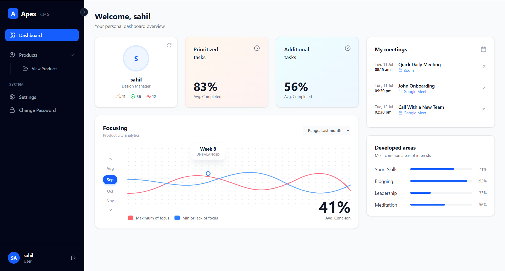

# 🚀 Apex CMS - Advanced Role-Based Admin Panel

Apex CMS is a powerful, enterprise-grade Content Management System (CMS) built with the **MERN Stack** (MongoDB, Express.js, React.js, Node.js). It provides secure authentication, advanced Role-Based Access Control (RBAC), media management, OTP-based password recovery, and soft-delete functionality, making it suitable for modern administrative applications.

---

## 📌 Overview

Apex CMS is designed to simplify administrative operations while maintaining high security standards and excellent user experience.

The system supports multiple user roles with different permission levels, secure session-based authentication, image uploads, data restoration through trash management, and responsive dashboard interfaces.

---

# ✨ Features

## 🔐 Authentication & Authorization

* Session-based Authentication using Passport.js
* Secure login and logout system
* Persistent user sessions
* Password hashing with Bcrypt.js
* Protected frontend and backend routes

---

## 👥 Role-Based Access Control (RBAC)

The system follows a strict hierarchical permission model.

### 🏆 Super Admin

* Complete system control
* Create, edit, delete, and restore users
* Manage administrators
* Full access to all modules

### 🛡️ Admin

* Full Category Management
* Manage Categories
* Manage Sub-Categories
* Manage Extra Categories
* Manage Products

### 📦 Manager

* Product Management
* Create Products
* Edit Products
* Delete Products
* Restore Products from Trash

### 👤 User

* Dashboard Access
* View Statistics
* Update Profile
* Change Password
* Personal Settings Management

---

## 🔑 OTP-Based Password Recovery

Secure password reset workflow:

* User enters registered email
* OTP is generated
* OTP sent using Nodemailer
* OTP expires in 2 minutes
* User verifies OTP
* User creates new password
* Password stored securely using Bcrypt hashing

---

## 🗑️ Soft Delete & Trash System

Instead of permanently deleting records:

* Records are marked as deleted
* Deleted data moves to Trash
* Data can be restored anytime
* Permanent deletion available when required

Supported Modules:

* Users
* Categories
* Sub-Categories
* Extra Categories
* Products

---

## 🖼️ Media Management

Supports:

* User Profile Images
* Product Images
* Image Upload Preview
* Image Replacement
* Image Deletion

Powered by:

* Multer
* Express
* MongoDB

---

## 🔎 Advanced Search & Filtering

Features include:

* Real-time Search
* Dynamic Filtering
* Table View
* Grid/Card View
* Instant Data Updates

---

## 🎨 Modern UI/UX

Built with:

* React 19
* Vite
* Tailwind CSS
* SweetAlert2
* Lucide React Icons

Features:

* Fully Responsive Design
* Smooth User Experience
* Modern Dashboard Layout
* Interactive Components

---

# 🛠️ Technology Stack

## Frontend

| Technology      | Purpose                     |
| --------------- | --------------------------- |
| React 19        | User Interface              |
| Vite            | Fast Development Build Tool |
| Tailwind CSS    | Styling                     |
| React Router v7 | Routing                     |
| Axios           | API Communication           |
| SweetAlert2     | Alerts & Notifications      |
| Lucide React    | Icons                       |

---

## Backend

| Technology      | Purpose              |
| --------------- | -------------------- |
| Node.js         | Runtime Environment  |
| Express.js      | Backend Framework    |
| MongoDB         | Database             |
| Mongoose        | ODM                  |
| Passport.js     | Authentication       |
| Express Session | Session Management   |
| Bcrypt.js       | Password Security    |
| Multer          | File Uploads         |
| Nodemailer      | OTP Email Service    |
| CORS            | Cross-Origin Support |

---

# 🏗️ System Architecture

## Authentication Flow

```text
User Login
     ↓
React Frontend
     ↓
Express Backend
     ↓
Passport.js Validation
     ↓
MongoDB User Verification
     ↓
Session Cookie Creation
     ↓
Authenticated Dashboard Access
```

---

## OTP Password Reset Flow

```text
Enter Email
     ↓
Generate OTP
     ↓
Send OTP via Nodemailer
     ↓
OTP Verification
     ↓
Create New Password
     ↓
Password Hashing (Bcrypt)
     ↓
Password Updated
```

---

## Soft Delete Workflow

```text
Delete Request
     ↓
isDeleted = true
     ↓
Moved to Trash
     ↓
Restore OR Permanent Delete
```

---

# 📂 Project Modules

## User Management

* Create User
* Edit User
* Delete User
* Restore User
* Change Role
* Search Users

---

## Category Management

* Create Category
* Update Category
* Delete Category
* Restore Category

---

## Sub Category Management

* Create Sub Category
* Edit Sub Category
* Delete Sub Category
* Restore Sub Category

---

## Extra Category Management

* Create Extra Category
* Edit Extra Category
* Delete Extra Category
* Restore Extra Category

---

## Product Management

* Create Product
* Edit Product
* Upload Product Images
* Delete Product
* Restore Product
* Search Products

---

# ⚙️ Environment Variables

Create a `.env` file inside the backend folder:

```env
PORT=9000
MONGODB_URI=your_mongodb_connection_string
EMAIL_USER=your_email@gmail.com
EMAIL_PASS=your_app_password
```

---

# 🚀 Installation

## Clone Repository

```bash
git clone https://github.com/masterSahil/NodeJS-Projects/tree/main/8.%20Admin%20Panel%20Complete
```

---

## Install Backend Dependencies

```bash
cd backend
npm install
```
---

## Install Frontend Dependencies

```bash
cd frontend
npm install
```
---

## Start Backend

```bash
npm run dev
```

---

## Start Frontend

```bash
npm run dev
```

---

# 📸 Video Presentation
Google Drive Link: https://drive.google.com/file/d/1eDVW_uAJYfl5-L5B7C3D_8ZfTvTBHRYP/view?usp=sharing


# 📸 Screenshots

### Login Page


### Super Admin Page


### Add Products Page


### View Products Table View


### View Products Card View


### View Products Trash View


### Admin Dashboard


### Manager Dashboard


### User Dashboard


---

# 🔒 Security Features

* Session-Based Authentication
* Role-Based Authorization
* Protected API Routes
* Bcrypt Password Hashing
* OTP Expiration Validation
* Secure Cookie Handling
* Input Validation
* CORS Protection

---

# 📈 Future Enhancements

* JWT Authentication
* Activity Logs
* Audit Trails
* Dark Mode
* Multi-Language Support
* Cloud Storage Integration
* Export Reports (PDF/Excel)
* Analytics Dashboard
* Email Templates
* Two-Factor Authentication (2FA)

---

# 👨‍💻 Author

**Sahil**

Full Stack MERN Developer

Skills:

* React.js
* Node.js
* Express.js
* MongoDB
* Tailwind CSS
* Authentication & Authorization
* REST APIs
* RBAC Systems