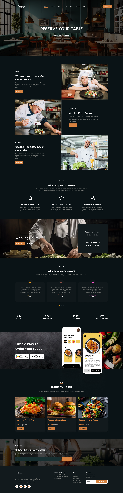

# 🍽️ Taste Nest - Fast Food Restaurant Website

A modern and fully responsive restaurant landing page built using **React.js**, **Vite**, and **Tailwind CSS**. This project was created by converting a professional Figma design into a functional and visually appealing web application.

---

## 📖 Project Overview

Taste Nest is a restaurant website designed to showcase a restaurant's services, menu items, chefs, reservation system, testimonials, mobile app promotion, newsletter subscription, and contact information.

The website focuses on:

- Modern UI/UX Design
- Fully Responsive Layout
- Fast Performance
- Clean Component Structure
- Pixel-Perfect Figma Conversion

---

## 🚀 Live Features

### 🏠 Hero Section
- Full-screen restaurant banner
- Navigation menu
- Call-to-action reservation button

### 👨‍🍳 About Section
- Restaurant introduction
- Chef showcase
- Coffee and food highlights
- Read More buttons

### ⭐ Why Choose Us
- Feature cards
- Quality-focused content
- Modern icon-based layout

### 📅 Reservation Section
- Working hours display
- Reservation call-to-action
- Attractive background imagery

### 💬 Testimonials Section
- Customer reviews
- Ratings display
- Restaurant statistics

### 📱 Mobile App Promotion
- App showcase section
- Google Play button
- Apple Store button

### 🍔 Food Menu Showcase
- Featured food cards
- Pricing information
- Order Now buttons

### 📧 Newsletter Subscription
- Email subscription form
- Modern design

### 📞 Footer Section
- Contact details
- Opening hours
- Useful links
- Social media icons

---

## 🛠️ Technologies Used

| Technology | Purpose |
|------------|----------|
| React.js | Frontend Framework |
| Vite | Development Environment |
| Tailwind CSS | Styling |
| JavaScript (ES6+) | Application Logic |
| HTML5 | Structure |
| CSS3 | Additional Styling |
| Google Fonts (Poppins) | Typography |

---

## 📂 Folder Structure

```bash
Taste-Nest/
│
├── public/
│   ├── images/
│   └── svgs/
│
├── src/
│   ├── assets/
│   │
│   ├── component/
│   │   ├── About.jsx
│   │   ├── Footer.jsx
│   │   ├── GrandSection.jsx
│   │   ├── Hero.jsx
│   │   ├── Navbar.jsx
│   │   ├── Reservation.jsx
│   │   └── WhyChooseUs.jsx
│   │
│   ├── App.jsx
│   ├── App.css
│   ├── index.css
│   └── main.jsx
│
├── index.html
├── package.json
├── vite.config.js
└── README.md
```

---

## 📸 Project Screenshot

### Full Website Preview



---

## 🎥 Project Demo Video

Add your project demo video link below:

<video src="./src/assets/video.mp4" controls muted autoplay></video>

---

## 📱 Responsive Design

This project is optimized for:

- ✅ Mobile Devices
- ✅ Tablets
- ✅ Laptops
- ✅ Desktop Screens
- ✅ Large Displays

---

## 🎨 Design Highlights

- Dark Restaurant Theme
- Elegant Typography
- Modern Cards
- Attractive Food Showcase
- Smooth Layout Structure
- Professional Color Palette
- Figma-to-Code Conversion

---

## 📚 Learning Outcomes

Through this project, I learned:

- Figma to React Conversion
- Component-Based Architecture
- Tailwind CSS Layout Design
- Responsive Web Design
- Reusable UI Components
- Modern Frontend Development Practices

---

## 👨‍💻 Author

**Sahil**

---